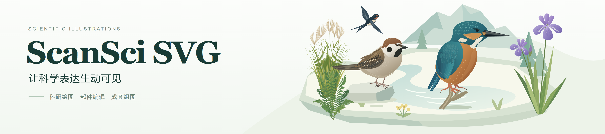
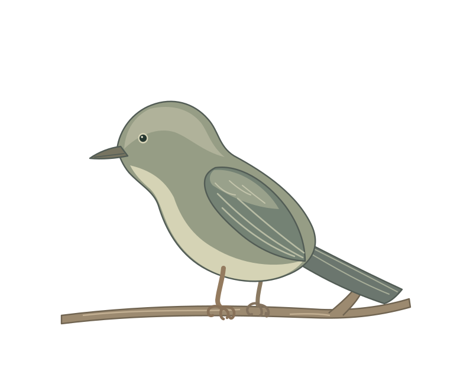
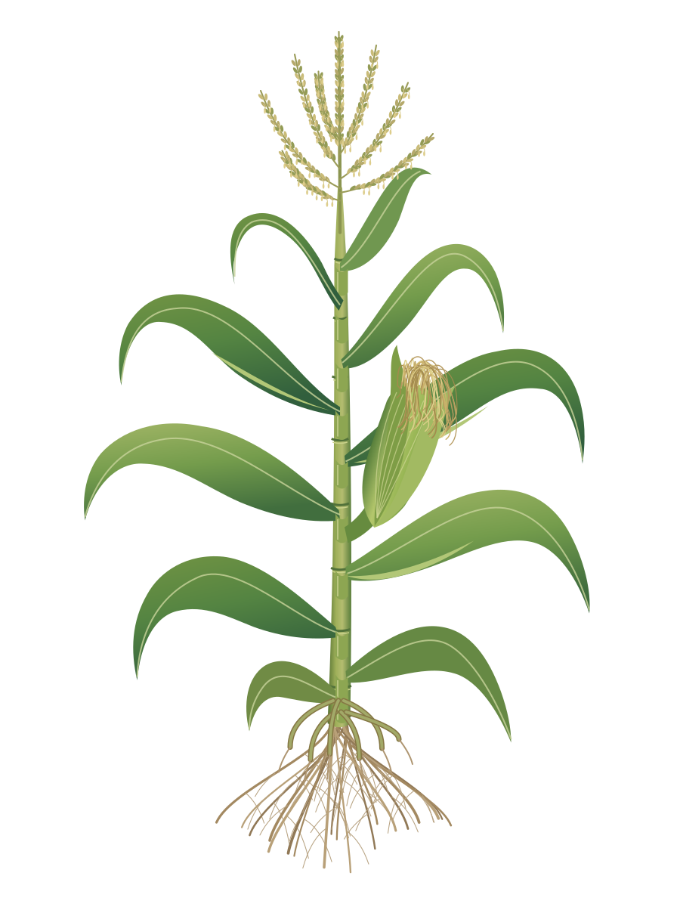
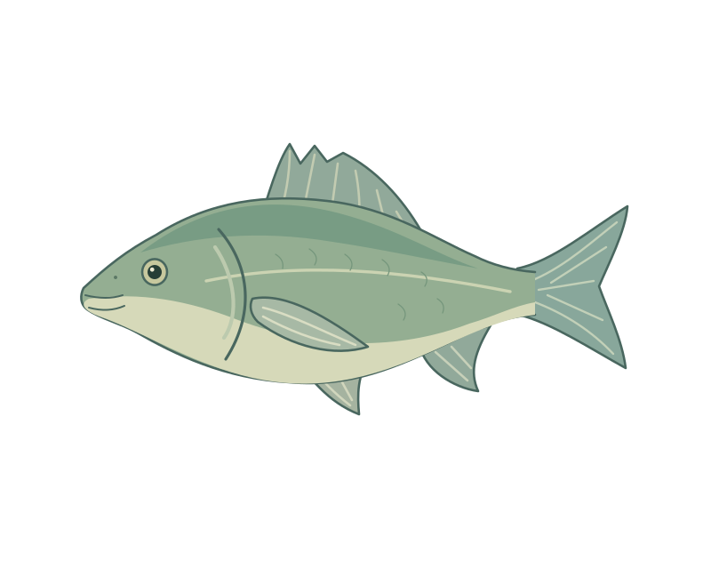

<div align="center">

<a href="assets/brand/scansci-svg-banner.svg"></a>
<p><a href="https://www.scansci.com/symbols/">看素材</a> · <a href="#quick-start">快速开始</a> · <a href="#use-cases">使用场景</a> · <a href="skill/references/svg-handbook.md">SVG 百科</a> · <a href="#installation">手动安装</a></p>

</div>

ScanSci SVG 帮助 AI Agent 完成科研绘图、部件编辑、素材组图、格式转换与兼容修复。描述需求或提供文件，它会结合输入和用途选择工具，制作结果并检查交付中的实际效果。

> **推荐使用 GPT-6 Astra。** 绘图需要模型能读取参考图、写入文件并查看实际渲染结果。

<a id="quick-start"></a>

## 快速开始

把这句话发给支持安装 skill 的 Agent，例如 Codex：

```text
帮我安装这个 skill：https://github.com/Rimagination/scansci-svg
使用仓库中的 skill/ 目录作为安装内容。
```

安装后，直接描述任务：

```text
使用 $scansci-svg，画一株开花期水稻，根、茎、叶、穗分别可编辑。
```

有参考图时，把图片一起附上：

```text
使用 $scansci-svg，把这张科研示意图转成可编辑 SVG。
保持原图构图、比例、文字和箭头方向，主要对象能单独修改。
```

默认得到 **SVG 源文件 + 实际渲染预览**。需要 PPT、动画或更多版本时，在同一段对话里继续提出要求。

<a id="use-cases"></a>

## 你可以用它做什么

| 你想做的事 | 可以直接这样说 |
| --- | --- |
| **从描述画图** | “画大肠杆菌示意图，显示细胞及运动相关结构。” |
| **植物黑白线稿** | “参考实拍和形态描述，画一株植物志风格的黑白线稿，轮廓、叶脉和点描分别可编辑。” |
| **画库外物种** | “素材库没有戴胜，请查影像数据库，参考实拍画一只，羽冠、翅膀和尾羽分别可编辑。” |
| **还原参考图片** | “把这张图转成 SVG，保留构图、标签、颜色和对象关系。” |
| **精细临摹** | “参考这张鸟类插画，保留羽毛斑纹、轮廓和明暗层次。” |
| **修改一个部件** | “修正青蛙的后肢连接，保留身体、配色和整体姿态。” |
| **制作成套变体** | “同一株玉米做自然配色、根系强调、果穗强调三版，姿态保持一致。” |
| **组合论文图** | “把水稻、小麦和玉米排成三面板对比图，统一标签，注明非等比例示意。” |
| **复用素材组成场景** | “用素材库里的鸟、植物和监测设施组成河岸示意图；对象和对应标签可以一起移动。” |
| **联动修改局部图** | “把右侧复叶图缩小并向下移动，引线仍指向全株中同一片叶子的叶柄。” |
| **交付可编辑 PPT** | “把这张图转成 PPTX，文字和主要部件能单独修改。” |
| **生成绘制回放** | “给这张 SVG 生成从线稿到成稿的离散回放，交一个可播放的离线 HTML。” |
| **查原理与排错** | “为什么 SVG 在浏览器里正常，导入编辑器后箭头和字体变了？” |
| **选择转换路线** | “这张 SVG 要用于 PowerPoint 和期刊 PDF，各怎样导出才能保留需要的编辑能力？” |

涉及具体物种、设备型号或科学机制时，会结合已有资料核实影响绘制的特征。需求存在会改变结果的歧义时，先追问关键选择。

植物线稿支持轮廓层级、点描与排线，以及按需组织诊断局部；[查看线稿模式](skill/references/botanical-line-art.md)。

库外物种可连接 **iNaturalist、GBIF** 查带来源的影像参考，核对学名与形态后绘制。当前公开检索无需登录，参考记录可复用；[查看使用方式](skill/references/species-image-reference.md)。

## 有 SVG 相关需求，直接交给它处理

[打开百科总索引](skill/references/svg-handbook.md) · [查看转换速查表](skill/references/svg-handbook.md#conversion-map)

例如：“导出宽 2400 像素的透明 PNG”“把 R 作图脚本导出为文字可编辑的 SVG”“修复转 PDF 后的缺字和箭头错位”。信息充分时直接执行；影响结果的缺项会先追问。首选工具缺失时寻找能保留所需能力的替代，出现明确失真时继续修复。

背后的六个知识专题提供格式选择、工具用法与排错依据，按当前任务读取。已实测的工作流、官方文档路线及需要重建的情况分别标明。只想了解原理时也可以直接问，skill 会按知识问答处理。

## 一张图，可以接着这样改

以玉米全株图为例，成稿后可以继续说：

```text
把根系标注改成中英双语，并调整引线。
```

```text
再做根系强调和果穗强调两版，沿用这株玉米的形态。
```

```text
把三版排成一张论文图，统一标题和间距，再给我可编辑 PPT。
```

同一个对象沿用原有部件与源稿。共用标签可以同步修改，各版的强调样式继续保留；需要改变生长阶段或形态时，按对应结构重新绘制。

## 按用途还原细节

**科研示意图重建**侧重对象、文字、连接和可编辑部件，保留参考的构图与科学含义。**精细临摹**进一步还原复杂轮廓、线宽、斑纹、纹理和明暗，同一张图可以分区域采用两种画法。

叶脉、羽毛、刻度和数据点等有意义的细节会保留；压缩色斑、描摹残边和重复碎片按来源清理。细节取舍结合参考图和最终展示尺寸，路径数量随内容需要确定。

绘制回放可以按线稿、固有色、阴影和细节编排，步骤直接切换，保留成稿本身的渐变与透明效果。回放根据成稿重建绘制顺序；已有真实编辑记录时可沿用记录。

## 素材与参考

绘图参考覆盖 **16 个主题领域、149 个 SVG 子类**，包含植物、动物、微生物、人体器官、环境、仪器与工程设施等。在线素材库按对象分类，方便查找。

<table>
  <tr>
    <td align="center" width="33%"><a href="skill/assets/library/animal_bird.svg"></a><br><strong>枝上鸣禽</strong></td>
    <td align="center" width="33%"><a href="skill/assets/plants/whole-maize.svg"></a><br><strong>玉米全株</strong></td>
    <td align="center" width="33%"><a href="skill/assets/library/animal_bony_fish.svg"></a><br><strong>硬骨鱼</strong></td>
  </tr>
</table>

上面展示的是仓库中的 SVG 素材，点击可查看源文件。顶部宣传横幅也附有[可编辑 SVG](assets/brand/scansci-svg-banner.svg)。

- [在线浏览与下载](https://www.scansci.com/symbols/)
- [149 类素材索引](skill/references/taxonomy.md) · [仓库素材清单](skill/assets/library/catalog.json)
- [10 件全株植物](skill/assets/plants/catalog.json) · [植物参考来源](skill/assets/plants/REFERENCES.md)
- [6 件自然插画](skill/assets/nature/catalog.json) · [河岸场景](skill/assets/scenes/riverbank/scene.json) · [全株与复叶局部](skill/assets/scenes/plant-detail/scene.json)：组合工具可检索 14 个已标注组件，复用原有路径；通过配方修改对象位置与尺寸，重新生成关联的端点和标签，见 [用素材库组织场景](skill/references/figure-composition.md#用素材库组织场景)。

<a id="installation"></a>

## 安装与运行

使用上面的对话安装方式即可开始。需要手动安装时，展开对应系统的步骤。

<details>
<summary><strong>Windows · PowerShell 7</strong></summary>

```powershell
git clone https://github.com/Rimagination/scansci-svg.git
cd scansci-svg
$skillRoot = if ($env:CODEX_HOME) { Join-Path $env:CODEX_HOME 'skills' } else { Join-Path $HOME '.codex/skills' }
./sync.ps1 -Destination (Join-Path $skillRoot 'scansci-svg')
```

脚本先备份已有安装，再复制更新；添加 `-WhatIf` 可预览操作。安装后重新加载宿主的 skill 列表。

</details>

<details>
<summary><strong>macOS / Linux · Codex</strong></summary>

```bash
git clone https://github.com/Rimagination/scansci-svg.git
cd scansci-svg
mkdir -p "${CODEX_HOME:-$HOME/.codex}/skills/scansci-svg"
cp -R skill/. "${CODEX_HOME:-$HOME/.codex}/skills/scansci-svg/"
```

安装后重新加载宿主的 skill 列表。更新已有安装前，可先备份其中的个人修改。

</details>

<details>
<summary><strong>其他 Agent 与按需工具</strong></summary>

将 `skill/` 的内容放入宿主的 `skills/scansci-svg/`，最终入口为 `skills/scansci-svg/SKILL.md`。模型需要能看图、写文件并检查渲染结果。

| 任务 | 使用的工具 |
| --- | --- |
| SVG 绘制与预览 | 宿主的文件工具、浏览器或 SVG 渲染器 |
| 重复拼版、简单部件修改、结构检查 | 仓库中的 Python 3 脚本，使用标准库 |
| 参考插画描摹与局部混合 | 可选 `trace_svg.py`，使用 Pillow 与 VTracer；见 [描摹与部件整理](skill/references/editable-workflow.md#描摹与部件整理) |
| 可编辑 PPTX | 宿主已有的原生形状导出工具，例如 EasySlides；见 [PPTX 交付](skill/references/pptx-delivery.md) |
| 离线 HTML 绘制回放 | Node.js、Playwright、Chromium；生成后的 HTML 可直接在浏览器打开 |
| MP4 / GIF 回放与过程动画 | 在浏览器渲染基础上使用 FFmpeg 编码 |

按任务准备对应工具。PPTX 中的字体、渐变和复杂分组需要检查实际导出效果；指定 Illustrator、Inkscape 等编辑器时，也按目标应用核对。

</details>

## 进一步使用

- **组图与变体**：[科研组图](skill/references/figure-composition.md) · [成套变体](skill/references/variation-and-learning.md)
- **编辑与导出**：[文字和部件修改](skill/references/editable-workflow.md) · [可编辑 PPTX](skill/references/pptx-delivery.md)
- **动态展示**：[绘制回放](skill/references/drawing-replay.md) · [科学过程动画](skill/references/scientific-animation.md)
- **分享作品**：生成满意的 SVG 后，可以说“帮我上传 ScanSci”。按 [投稿流程](skill/references/scansci-upload.md) 准备成稿与信息，登录和提交依据站点当时可用的服务完成。

<details>
<summary><strong>维护、检查与效果评测</strong></summary>

维护源码位于 `skill/`，入口为 [SKILL.md](skill/SKILL.md)。`references/` 存放方法与交付参考，`assets/` 存放素材，`scripts/` 提供编辑、拼版、回放和检查工具，`evals/` 存放评测题。

结构与编辑范围检查示例：

```bash
python skill/scripts/check_svg.py skill/assets/library/animal_bird.svg
python skill/scripts/test_edit_scope.py
```

效果按同条件任务对照记录，包含还原质量、实际返修、编辑结果和完整耗时。[首批工作流试点](skill/references/evaluation.md#2026-09-09-工作流试点) 中，两组均通过三道基础任务检查，完整规范文本未显示额外质量优势；后续用真实任务继续验证工具复用与编辑流程的作用。

个人照片、实验输出和安装备份保存在 Git 忽略的 `.local/`。素材网站由独立的 [scansci-portal](https://github.com/Rimagination/scansci-portal) 项目维护。

</details>

## 来源与许可

来源与授权信息随素材和参考记录保留，鸟类生成范例附独立提示词及生成记录。标明 **CC BY 4.0** 的基础素材沿用该许可并署名 ScanSci；其余文件按各自声明使用。本仓库尚未指定覆盖全部文件的统一许可。
